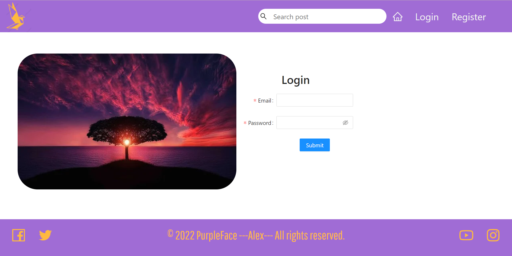
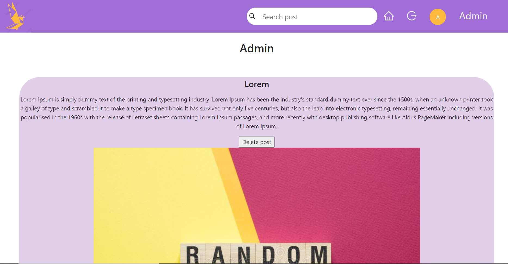
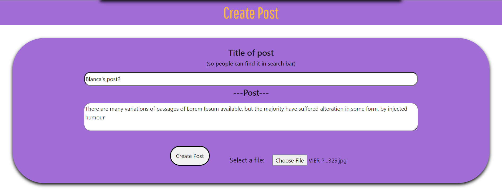
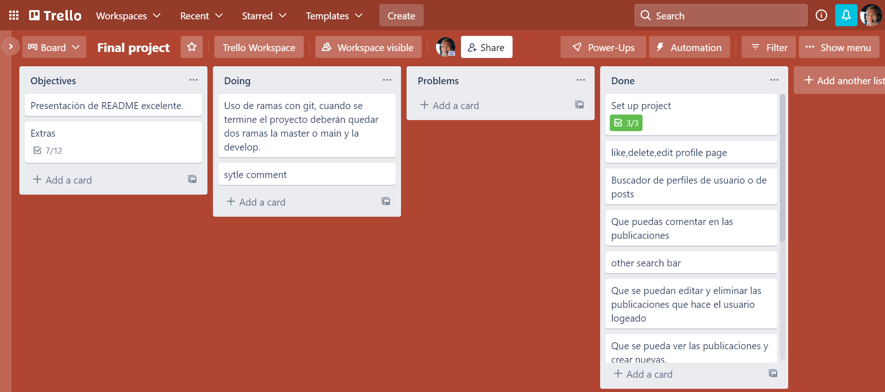

#  <center>Social media React Redux</center> 

 ## :bookmark: Index 

- [Acknowledgment](#)

 - [About the project](#)

 - [Requirements](#)

    - [Installation and deployment](#)

    - [Technologies used](#)

    - [Source](#)

    - [Objectives](#)

- [Challenges presented](#)

    - [XXXXXXXXXX](#)

    - [XXXXXXXXXX](#)

- [Things we would have liked to have added](#)

- [Authors](#)

## Acknowledgment

First of all I would like to thank my teachers [Sofia](https://github.com/SofiaPinilla) [Germán](https://github.com/GeerDev) and [Ivan](https://github.com/ivanpuebla10) for teaching us React and for their pacience with us. We would also like to thank all of our classmates from the Bootcamp for always being there to help us resolve problems or simply to give us some constructive critism.

## About the project

This project unifies everything learned so far. We will develop a social media site where users will register, login, view posts and create posts using the backend API I created in the 1st Backend Project.

## Requirements
Once the needs of the project have been analyzed, it is expected
that the student develops a frontend that is capable of the following:
● User registration.
● User login.
● That you can see the publications and create new ones.
● That the publications made by the logged in user can be edited and deleted
● Give/remove Like a post.
● Search engine for user profiles or posts
● That in your profile you can see your data and your posts
● That you can comment on the publications


Essential requirements of the project:
● Use of branches with git, when the project is finished there should be two branches, the master or main and the develop.
● Excellent README presentation.

## Installation and deployment

BackEnd

    1. Download the repository from (https://github.com/alextebbitt/Backend-project) using `git clone https://github.com/alextebbitt/Backend-project`  From the terimal in whichever folder you like.  

    2. Once the repository has been cloned, all the packages needed for the project must be installed with `npm i` 

    3. Inside the config folder, you must copy the file called `config.example.json` and name it `config.json`, inside you have to enter the following information:
    
```JSON
{
    "development": {
        "username": "Your user", // Here enter your mysql username 
        "password": "Your pass", //Enter your mysql password
        "database": "Your db", // The name of your database
        "host": "Your host", //Your host
        "dialect": "mysql",
        "jwt_secret": "YourJWTPass", //The password to verify that the sender of the JWT is who they say they are
        "auth": {
            "user": "yourMail@gmail.com", //Name of the email address with which you want to send the confirmation email to register
            "pass": "YourPass" //Password of that email account
        }
    },
    ...
}
```
    5. Inside the cloned folder of (https://github.com/alextebbitt/Backend-project) you have to run the command `npm start`

- FrontEnd

    1. Download the repository from (https://github.com/alextebbitt/Front-End-Redux-Social-Media) using `git clone https://github.com/alextebbitt/Front-End-Redux-Social-Media` From the terimal in whichever folder you like.

    2. Once the repository is cloned, you have to install all the packages that the project needs with `npm i`

    3. Inside the cloned folder of (https://github.com/alextebbitt/Front-End-Redux-Social-Media) you have to run the command `npm start`

## Technologies used

```JavaScript
const project = {
    frontEnd:{
        main:["JavaScript","React","sass"],
        modules:[
            "react-router-dom",
            "antd",
            "@ant-design/icons",
            "axios",
            "normalize.css"
        ]
    },
    backEnd:{
        main:["JavaScript","MongoDB","NodeJS","Express","Mongoose"],
        modules:[
            "Nodemailer",
            "Bcrypt",
            "Jsonwebtoken",
            "Multer",
            "Postman"
        ]
    }
} 
```
 ## Source


The project originates from the FullStack bootcamp at [TheBridge](https://www.thebridge.tech/), It consists of transferring the frontend to a previous backend project, thus achieving a Full-Stack project. The main objective is to create a functional e-commerce SPA (Single Page Application), using Redux.


### Log in page


### Register page


### Admin page


### Create a post


## Organization

To organize the tasks I have used the application [Trello](https://trello.com/) with which you can comfortably manage tasks and "Tickets"

### Screenshot of Trello



## Challenges presented

This was an incredibly difficult project, given that I did not know about React a few weeks ago. It has been a steep learning curve, but I am still motivated to continue learning and gettting better.  


## Things I would have liked to have added

- Add likes to a comment

- User profile picture

- See users post in user search page


## Authors

### [Alex Tebbitt](https://github.com/alextebbitt)
